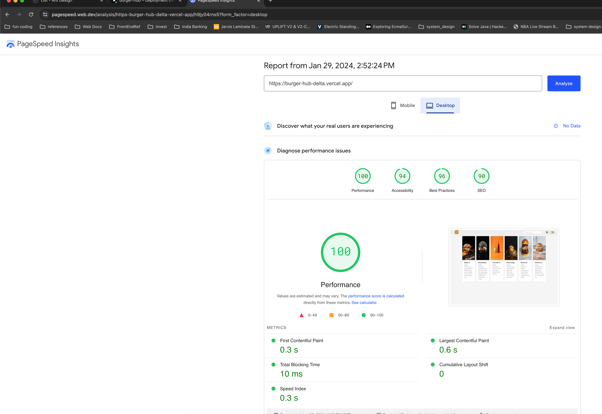

## Introduction

Burger Hub is a simple burger ordering web app. Can be accessed live at https://burger-hub-delta.vercel.app/

### Functional requirements

- A Food Menu page
- A Menu Item detail page with the ability to add it to the shopping cart
- Shopping cart view that displays added items and the total price of the cart with the ability to delete items
- Theme toggle to switch between light and dark themes

### Technology stack

- TypeScript, React for interative UI
- Next.js for routing, server components and component streaming, image optimization, caching and build tooling
- Ant design and TailwindCSS for design. Responsive design is applied reasonably as well
- Jest and react-testing-library for unit and component tests
- Cypress for e2e tests

## Getting Started

### Running locally

To run the app locally, run the following commands at the root of the project:

```bash
# setup
$ nvm use && npm i

# run dev server
$ npm run dev
```

Open [http://localhost:3000](http://localhost:3000) with your browser to see the result.

### Production build and test

```bash
# create a production build
$ npm run build

# run unit and component tests
$ npm run test

# run e2e tests
$ npm run test:e2e:ci
```

## Technical Considerations

- To keep the scope of the project minimal, used React Context for storing the shopping cart. So refreshing the web app will reset the shopping cart.
- Used Server components for the Menu List page and the Menu Item page for better First Contentful Paint, better SEO and other server side rendering benefits
- Used Next.js Image component for it's features like preventing layout shift, lazy loading images, priority fetching etc
- Integrated Ant design's theming functionality with the app's React context for implementing light/dark theme toggle across the app
- Added shared components like skeleton view, list grid view etc for maximum re-use across the app
- Added a unit test for the shopping cart reducer, a component test for the view cart button and an e2e test showing the overall flow

Here is the desktop performance report from Page Speed Insights:


